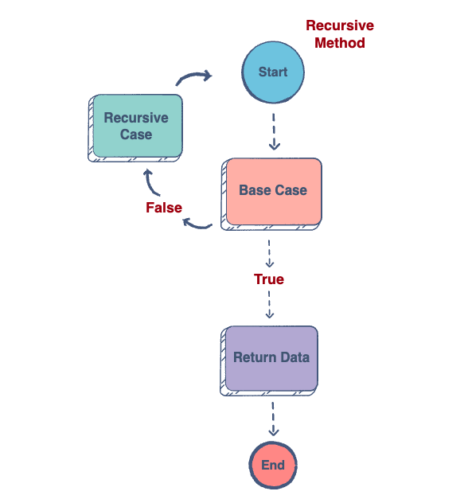
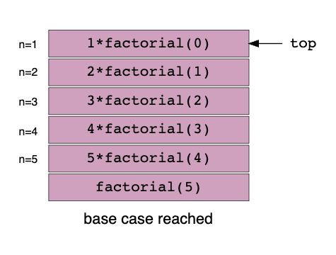
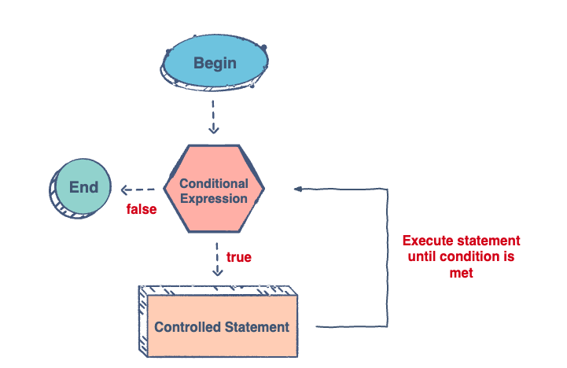

# What is Recursion?

**Recursion** is when *a method calls itself again and again until it reaches a specified stopping condition.* In general, the method mentioned above is called a **recursive method.**

## Why recursion?

* Recursive code is generally shorter to write as compared to an iterative code.
* In general, loops are converted into recursive methods when they are compiled or interpreted.
* A recursive method is most useful for tasks that can be defined in terms of similar subtasks.

## Format of a recursive method

Each recursive method consists of 2 parts:

1. **Base Case:** The base case is where the call to the method stops, meaning, it does not make any subsequent recursive calls.
2. **Recursive Case:** The recursive case is where the method calls itself again and again until it reaches the base case.



## Generic recursive algorithm

```
RecursiveMethod() {
  // Base Case
  if (base case condition) {
    return some base case value;
  }
  else {
    // Recursive Case
    return (some work and then a recursive call to RecursiveMethod())
  }
}
```

## Recursion and Memory Visualization

This lesson will discuss how recursive methods use the stack.

### Memory allocation to methods

When a method is called, the state of the method is placed on the call stack along with the information about where it was called from. This tells the run-time where it should return to when the current method finishes executing. Each recursive call pushes a new stack frame. A stack frame consists of information such as the return address, argument variables, and local variables related to that method call.

When a method calls itself, the new method call gets added to the top of the call stack and execution of the current method pauses while the recursive call is being processed. When the base case is reached the stack frames start popping from the stack until the stack becomes empty.

### Example

A factorial is the product of an integer and all the positive integers below it. It is denoted by the symbol: !
!

For example, 4! (read as four factorial) is denoted as follows:

```
4!=4\times3\times2\times1=24
4!=4×3×2×1=24
```

For example, 6! (read as six factorial) is denoted as follows:

```
6!=6\times5\times4\times3\times2\times1=720
6!=6×5×4×3×2×1=720
```

### Code Example

```
public class FactorialExample {
    // Recursive function
    public static int factorial(int n) {
        // Base case
        if (n == 1) {
            return 1;
        }
        // Recursive case
        else {
            return (n * factorial(n-1));
        }
    }
}
```

We will now briefly discuss the two main parts of a recursive method, the base case and the recursive case, implemented in the code above.

### The Base Case

We have defined the base case on `line 5` where it states that when the variable `n` equals 1, the method should terminate and start popping frames from the stack.

### The Recursive Case

This is similar to the formula given above for the factorial. For example, in case of 3 factorial, `3!=3\times2\times1=6` we multiply the original number `n` with the integer that precedes it, `n-1`, and the recursive call, `factorial(n-1)`, is made until `n` reaches 1.

### Visualizing through Stack

The following illustration may help you to understand the code through a stack:



## Iteration

**Iterative** code is a block of code that runs in a loop. In other words, the same code is repeated over and over again. The idea is similar to that of recursion.

As you get comfortable with the recursion concept, you might not use iteration that frequently as you solve your problems, but there are definitely cases where you will find it valuable. This is also one of the easiest ways to ease yourself into recursion because we already understand how to iterate over arrays and lists. Recursion is basically taking the same concept forward but with some modifications.

For example,

* Print a Linked List in reverse order
* Factorial of a number
* Fibonacci series
* A problem where you expect to use a variable number of loops

### Conceptual illustration of iteration



### Challenge

Go to the package `edu.desu.iterativeVrecursive` and open class `Factorial`

Lets look at the function :

```
public static int factorialIterative(int n) {
    int factorialResult = 1;
    for (int i = 1; i <= n; i++) {
        factorialResult = factorialResult * i;
    }
    return factorialResult;
}
```

This function uses loops to do the calculation, how can we convert this over to recursion? Complete the function `factorialRecursive`.

## Homework

Open up the `Homework` and `HomeworkTest` classes and complete the 3 problems.


### Problem 01


Given a non-negative int n, return the count of the occurrences of 7 as a digit, so for example 717 yields 2. (no loops). 

Note that mod (%) by 10 yields the rightmost digit (126 % 10 is 6), while divide (/) by 10 removes the rightmost digit (126 / 10 is 12).

### Problem 02


Given a non-negative int n, compute recursively (no loops) the count of the occurrences of 8 as a digit, except that an 8 with another 8 immediately to its left counts double, so 8818 yields 4. Note that mod (%) by 10 yields the rightmost digit (126 % 10 is 6), while divide (/) by 10 removes the rightmost digit (126 / 10 is 12).

### Problem 03


Given base and n that are both 1 or more, compute recursively (no loops) the value of base to the n power, so powerN(3, 2) is 9 (3 squared).


